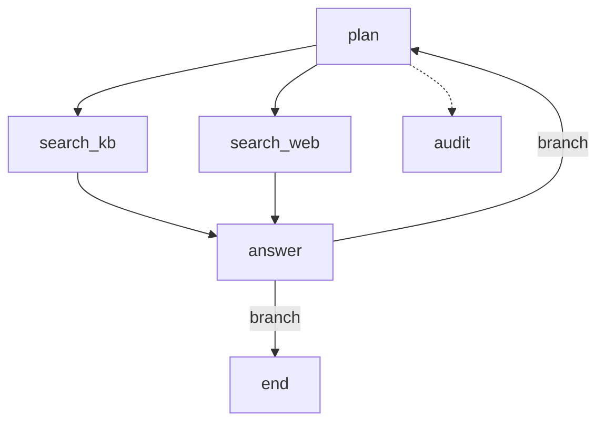

# flow

> Biblioteca Go para orquestrar agentes como grafo de estado. Pequena, tipada e concorrente por natureza.

`flow` executa um grafo de nós que compartilham um estado tipado. Cada nó é uma função Go comum; o runtime cuida de roteamento, paralelismo, retry, cancelamento, observabilidade e checkpoint.

> **Nota sobre o nome:** `flow` é um placeholder. O nome definitivo entra antes da tag `v0.1.0`, porque trocar depois quebra o import path de quem já usa.

---

## Por que isso existe

Orquestração de agente é, no fundo, uma máquina de estados com chamadas de I/O lentas no meio. Escrever isso à mão em Go funciona até o dia em que você precisa de duas buscas em paralelo, de um deadline global, de saber em qual nó a execução falhou às 3 da manhã, e de retomar de onde parou quando o pod cai.

Os frameworks que resolvem isso bem (LangGraph, Eino, ADK Go) resolvem muito mais do que isso. `flow` resolve só a parte do grafo, e faz uma aposta específica: **o objeto do grafo é imutável depois de compilado, e toda execução vive em sua própria goroutine sem estado compartilhado.** Milhares de execuções simultâneas custam o preço de milhares de goroutines, não de milhares de objetos sincronizados.

### O que esta lib não é

Isto não é um concorrente de LangGraph, Eino ou ADK Go, e não pretende ser. Não há aqui camada de modelo, abstração de tool, RAG, memória, prompt template ou registry de agentes. `flow` não sabe o que é um LLM. Se o seu nó chama um modelo, quem escreve a chamada é você.

Fora de escopo por decisão, não por falta de tempo:

- **Streaming propagado pelos nós.** Nó que devolve stream contamina toda a topologia: a aresta condicional precisa rotear antes do stream acabar, e não existe estado consistente para checkpointar no meio de um stream. O canal de eventos entrega tokens sem que a topologia precise saber disso.
- **Execução distribuída.** Fila, lease, idempotência e determinismo são outro produto. Chama-se Temporal.
- **Subgrafos.** Voltam se aparecer necessidade real.
- **DSL declarativa, hot reload, cache de nó.** Parecem baratos e não são.

---

## Instalação

```bash
go get github.com/nathanribeiroo/flow
```

Requer Go 1.25+ (a diretiva existe por causa de `testing/synctest`, usado na suíte).

---

## Em cinco minutos

```go
type State struct {
    Question string   `json:"question"`
    Plan     string   `json:"plan"`
    Docs     []string `json:"docs"`
    Answer   string   `json:"answer"`
}

g := flow.New[State]("support-agent").
    Add("plan", planNode).
    Add("search_kb", searchKB,
        flow.WithTimeout(3*time.Second),
        flow.WithOnFailure(flow.FailureSkip)).
    Add("search_web", searchWeb,
        flow.WithTimeout(3*time.Second),
        flow.WithOnFailure(flow.FailureSkip)).
    Add("answer", answerNode, flow.WithJoin(flow.JoinAll)).
    Add("audit", auditNode, flow.WithTimeout(10*time.Second)).
    Start("plan").
    Edge("plan", "search_kb").
    Edge("plan", "search_web").
    Edge("search_kb", "answer").
    Edge("search_web", "answer").
    Detach("plan", "audit").
    Branch("answer", retryOrFinish, "plan", flow.End)

runner, err := g.Compile()
if err != nil {
    return fmt.Errorf("compilando grafo: %w", err)
}

state := State{Question: q}
res, err := runner.Run(ctx, &state, flow.WithBudget(8*time.Second))
```

O que esse grafo faz: `plan` roda, dispara `search_kb` e `search_web` **em paralelo**, e dispara `audit` numa aresta destacada que não segura o fluxo. `answer` só roda quando as duas buscas terminam (`JoinAll`). Se uma das buscas falhar, `FailureSkip` deixa a execução seguir com resultado parcial, e o erro aparece em `res.Errors`. `retryOrFinish` decide entre voltar para `plan` ou terminar.

### O nó

```go
func searchKB(ctx context.Context, s *State) error {
    docs, err := kb.Search(ctx, s.Plan)
    if err != nil {
        return fmt.Errorf("buscando no kb: %w", err)
    }
    s.Docs = append(s.Docs, docs...)
    return nil
}
```

É isso. Nenhum tipo da lib aparece na assinatura além do seu próprio estado. Nó é testável sem grafo nenhum.

### O roteador

```go
func retryOrFinish(ctx context.Context, s *State) []string {
    if s.Answer == "" && len(s.Docs) < 3 {
        return []string{"plan"}
    }
    return []string{flow.End}
}
```

Devolve fatia porque roteador também faz fan-out. Os destinos possíveis são declarados no `Branch` — o runtime não consegue inspecionar sua função, e o Mermaid precisa saber desenhar as arestas.

**Um nó roteia de um jeito só.** `Edge` e `Branch` saindo do mesmo nó é erro de compilação. Quem precisa de "sempre C, às vezes Z" escreve um roteador que devolve os dois, e o comportamento fica em um lugar só em vez de espalhado por duas declarações. `Detach` é ortogonal e pode conviver com qualquer um dos dois.

---

## O modelo de execução

`flow` roda em **supersteps**, não com ponteiro de nó atual.

A cada passo existe uma *fronteira*: o conjunto de nós prontos para rodar. O runner executa a fronteira inteira em paralelo, espera todos terminarem, coleta as decisões de roteamento e calcula a próxima fronteira. Repete até a fronteira ficar vazia.

Isso é o que torna `A` e `B` em paralelo com `C` esperando os dois uma consequência natural do modelo, em vez de um caso especial. Quando a fronteira tem um nó só — o caso comum — o runner executa inline, sem goroutine e sem `errgroup`. O caminho linear não paga nada pelo paralelismo que ele não usa.

### Estado

Um `Run` recebe um `*S` e é dono dele até terminar. O grafo compilado não guarda estado nenhum, então o mesmo `Runner` atende quantas execuções simultâneas você quiser sem lock.

Dentro de um superstep, nós rodam em paralelo sobre o mesmo ponteiro. A regra é simples e vale a pena decorar: **cada nó escreve só nos campos que são dele.** Em desenvolvimento, `WithConflictCheck()` detecta violação comparando snapshots.

Nó em aresta destacada é a exceção: recebe uma **cópia** do estado, e o que ele escrever é descartado.

---

## Observabilidade

Duas superfícies, para dois usos diferentes.

**`Hook` é síncrono** e serve para tracing e métricas. `NodeStart` devolve o `context.Context` enriquecido, então o span do nó envolve a execução dele de verdade e o span pai desce para dentro da chamada HTTP:

```go
runner.Run(ctx, &state, flow.WithHook(otelHook{tracer}))
```

**O canal de eventos é assíncrono** e serve para UI: CLI ao vivo, log estruturado, replay. Envio não-bloqueante — consumidor lento perde evento, nunca segura o runner:

```go
events := make(chan flow.Event, 256)
go renderLive(events)
runner.Run(ctx, &state, flow.WithEvents(events))
```

Se os seus nós streamam token do modelo, publique os tokens nesse mesmo canal. Streaming vira ortogonal à topologia, que é exatamente o que queremos.

---

## Diagrama

```go
fmt.Println(runner.Mermaid())        // topologia
fmt.Println(runner.MermaidTrace(res)) // topologia com o caminho percorrido em destaque
```



Os ids saem prefixados e sanitizados porque `end`, `graph` e `class` são palavras reservadas do Mermaid, e nome de nó é string livre. O nome real fica no label. Aresta cheia é estática, `|branch|` é condicional, tracejada é `Detach`.

`MermaidTrace` é o motivo real do recurso existir: você cola o diagrama do turno que deu errado no canal da squad e a conversa acaba ali.

---

## Checkpoint e resume

Serializa na fronteira de superstep, que é o único ponto onde o estado é consistente:

```go
res, err := runner.Run(ctx, &state,
    flow.WithCheckpoint(store),
    flow.WithRunID(sessionID))

// depois de o pod morrer e voltar
state, res, err := runner.Resume(ctx, sessionID, flow.WithCheckpoint(store))
```

Consequência a aceitar desde a primeira linha: **`S` precisa ser serializável em JSON.** Nada de func, canal, conexão ou `context` dentro do estado.

O checkpoint carrega o hash da topologia. Retomar um checkpoint gerado por outro grafo devolve `ErrVersionMismatch` em vez de rodar errado silenciosamente.

Retomar reexecuta o passo que estava em andamento quando o processo caiu. Isso é *at-least-once* para os nós daquele passo: quem usa checkpoint precisa de nós idempotentes.

---

## Segurança de execução

Quatro proteções, todas ligadas por padrão:

| Proteção | Efeito |
| --- | --- |
| `WithMaxSteps(n)` | Corta ciclo infinito. Default: 50. |
| `WithBudget(d)` | Deadline da execução inteira, checado antes de cada superstep e aplicado ao `ctx`. |
| Cancelamento | O `ctx` do `Run` desce até dentro do nó. Cliente desligou, goroutine morre. |
| Progresso garantido | O join ordena candidatos, então todo passo avança. Travar é impossível por construção. |

Timeout por nó protege o nó. Orçamento protege o SLO. Você quer os dois.

---

## Testes

Não existe API especial de teste, e isso é proposital.

`Add` com um nome existente **substitui** o nó. Stub sai de graça:

```go
g := production.Clone().Add("call_llm", stubLLM)
```

`WithSequential()` roda a fronteira em ordem declarada, sem goroutine. Teste de grafo com fan-out deixa de ser flaky.

---

## Custo do runner

Microbenchmarks do overhead de orquestração, com nó vazio: é o que a lib adiciona por cima do que o seu nó faz. Apple M5, 10 núcleos, Go 1.26.1, sem `-race`, id gerado por `crypto/rand` (caminho padrão), mediana de três rodadas.

| Benchmark | Grafo | Tempo | Memória | Alocações |
| --- | --- | --- | --- | --- |
| `BenchmarkLinear` | 5 nós sequenciais | 1,11 µs/op | 1 272 B/op | 27 |
| `BenchmarkFanOut` | 1 → 4 → 1 | 6,2 µs/op | 2 064 B/op | 34 |
| `BenchmarkConcurrentRuns` | 1 → 4 → 1, 1 000 `Run` simultâneos | 2,3 µs/run | 2,1 KB/run | 36 |

Num turno de agente em que o modelo leva dois segundos, tudo isso é ruído. O número que importa é o terceiro: com mil execuções simultâneas o custo por `Run` **cai** para um terço do fan-out isolado, e as alocações ficam estáveis. É a aposta do grafo imutável sem estado compartilhado se confirmando.

## Roadmap

| Versão | Entrega |
| --- | --- |
| v0.1 | Builder, `Compile` com validação, runner sequencial, `Branch`, timeout e retry por nó, erros tipados, Mermaid |
| v0.2 | Superstep paralelo, `Join`, `OnFailure`, `Detach`, budget |
| v0.3 | `Hook`, canal de eventos, `MermaidTrace` |
| v0.4 | `Checkpointer`, `Resume` |
| v0.5 | `WithConflictCheck`, benchmarks, congelamento da API |

A API pública congela na v0.5. Antes disso, quebra sem dó.

---

## Licença

MIT.